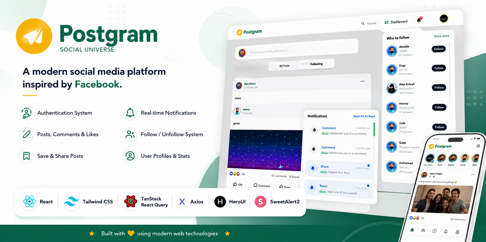
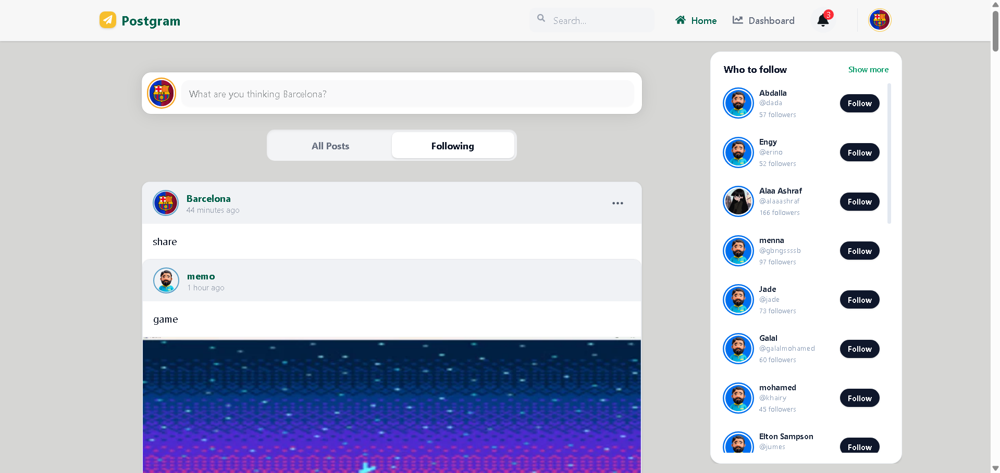
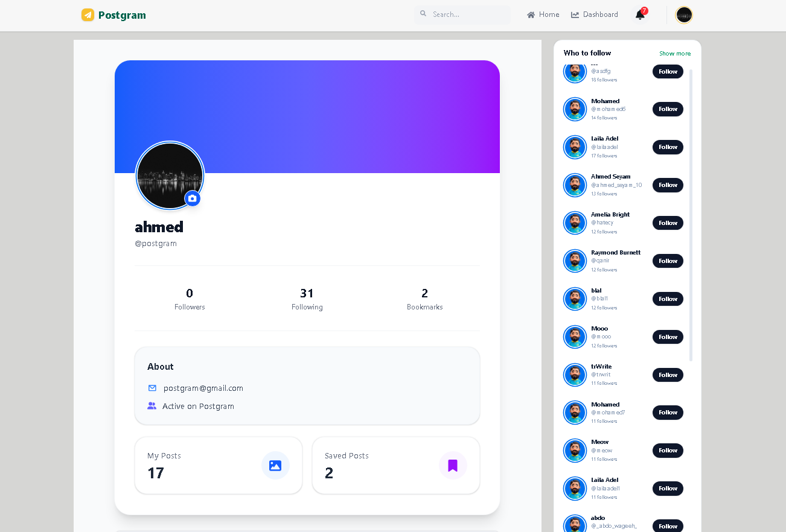
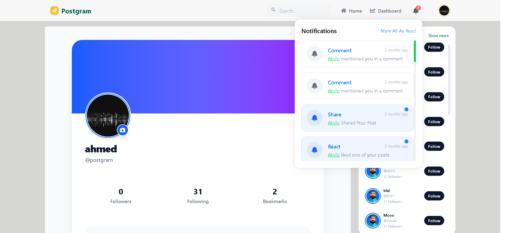

# 📱 Postgram

  

A modern social media platform inspired by Facebook, built with React and Tailwind CSS.

## 🌍 Live Demo

👉 https://postgram-jade.vercel.app/

## 📂 Repository

👉 https://github.com/a7medabdelmon3m/POSTGRAM

## 📑 Table of Contents

- Features
- Tech Stack
- Screenshots
- Architecture
- Installation
- Folder Structure
- Future Improvements
- Acknowledgments
src
├── api
├── assets
├── components
├── hooks
├── layouts
├── pages
├── services
├── utils
└── types

## 📸 Screenshots

### Home Feed

### Profile

### Notifications

## 🚀 Future Improvements

- Chat System
- Dark Mode
- Infinite Scrolling
- Story Feature
- PWA Support

---

Made with ❤️ by Ahmed Abdelmoneim

⭐ If you like this project, don't forget to give it a star.

